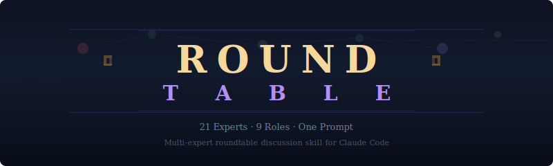

<div align="center">



**One prompt. Multiple experts. Real code analysis.**

[](https://claude.com/claude-code)
[](LICENSE)
[](#persona-pool)

</div>

---

## The Problem

You just built something. You review it yourself. Ship it. Then at 3am a race condition crashes production, a user finds an injection vector, and the PM asks why you shipped a feature nobody wanted.

**One pair of eyes has one set of blind spots.** A backend engineer won't think about player emotion. A PM won't catch the mutex you forgot. A game designer won't notice the SQL injection.

## The Solution

Roundtable launches **up to 4 independent expert agents in parallel** — each with a distinct professional persona, reading your actual code — then synthesizes their findings into a structured discussion. Not merged consensus. **Preserved disagreements.** Because the most valuable insight is where Jensen says "double down on execution" and Miyamoto says "the player hasn't smiled yet."

```
You: "roundtable: evaluate this feature plan"
         │
         ▼
   ┌─────────────┐
   │ Role Select  │  Analyze task → pick up to 4 from 37 experts
   │ (automatic)  │  → different experts each time
   └──────┬──────┘
          │
    ┌─────┼─────┬─────┐
    ▼     ▼     ▼     ▼
  ┌───────┐┌─────┐┌────────┐┌─────────┐
  │Jensen ││Linus││Karpathy││Miyamoto │  Each reads real code
  │(CEO)  ││(Rev)││(AI)    ││(Game)   │  independently, in parallel
  └──┬────┘└──┬──┘└──┬─────┘└──┬──────┘
     │        │      │         │
     └────────┼──────┼─────────┘
              ▼
   ┌──────────────┐
   │  Synthesize   │  Consensus → Disagreements → Actions
   └──────────────┘
```

---

## Quick Start

### Install

```bash
git clone https://github.com/nemoaigc/roundtable.git ~/.claude/skills/roundtable
```

### Use

Just talk naturally:

```
> roundtable: should we add caching to the API layer?
> let's get the team to discuss this PR
> have the experts evaluate our auth implementation
```

The skill auto-selects relevant experts and launches them.

---

## Persona Pool

37 experts across 14 roles. Each roundtable picks **different personas** based on what the discussion needs — so the same question asked twice gets different perspectives.

### CEO

| Persona | Style | Best For |
|---------|-------|----------|
| **Jensen Huang** | "No retreat is the way forward." Technical execution, leverage optimization. | Strategic tech decisions, resource allocation |
| **Sam Altman** | "Move fast, be bold." Timing, scaling, shipping speed. | AI product direction, market timing |
| **Patrick Collison** | "We haven't built anything yet." Craft, longevity, elegant constraints. | Infrastructure decisions, long-term trade-offs |

### Product Managers

| Persona | Style | Best For |
|---------|-------|----------|
| **Butterfield** | "Every great product starts with a human problem." Watches users before asking. | User empathy, daily friction |
| **Bezos** | "Start with the customer and work backwards." Writes the press release first. | ROI, flywheel effects, one-way doors |
| **Shreyas Doshi** | "The most underrated PM skill is knowing what NOT to build." Priority frameworks, execution discipline. | Prioritization, execution rhythm |

### AI Engineers

| Persona | Style | Best For |
|---------|-------|----------|
| **Karpathy** | "The most common error is not running the code." Builds first. | Prompt engineering, LLM behavior |
| **Swyx** | Sees everything as sense→think→act→observe loops. Paranoid about silent failures. | Agent architecture, file contracts |
| **Simon Willison** | "The best prompt is the one that ships." Datasette creator. | Practical prompt testing, cross-model compatibility |

### Code Reviewers

| Persona | Style | Best For |
|---------|-------|----------|
| **Linus** | "Talk is cheap. Show me the code." Finds the bug on line 47. | Bug hunting, race conditions |
| **Carmack** | Reviews from first principles. Hates unnecessary abstractions. | Performance, simplification |

### Frontend Developers

| Persona | Style | Best For |
|---------|-------|----------|
| **Dan Abramov** | "The mental model matters more than the API." React core, state philosophy. | State bugs, stale closures, component design |
| **Evan You** | "A framework should work where you can't feel it." Vue/Vite creator. | Build perf, DX, eliminating boilerplate |
| **Guillermo Rauch** | "If it doesn't deploy in one command, it's not done." Next.js/Vercel. | Deploy friction, framework selection, one-prompt-to-production |

### Backend Developers

| Persona | Style | Best For |
|---------|-------|----------|
| **DHH** | "Convention over configuration." Hates microservices. | API design, monolith vs distributed, pragmatism |
| **Antirez** | "Simplicity is a prerequisite for reliability." Redis creator. | Data structures, concurrency, crash safety |

### Game Designers

| Persona | Style | Best For |
|---------|-------|----------|
| **Miyamoto** | Designs for the smile in the first 10 seconds. Subtraction design. | Onboarding, intuitive UX |
| **Jonathan Blow** | "Solve by understanding, not by trying everything." Braid, The Witness. | Deep puzzles, conceptual depth |
| **Nicky Case** | "Let people play with complex ideas." Evolution of Trust. | Web-native interactives, education |

### Security Engineers

| Persona | Style | Best For |
|---------|-------|----------|
| **Schneier** | "Security is not a product, but a process." Thinks in threat models. | Threat modeling, trust boundaries |
| **Mitnick** | Thinks like an attacker. Humans are the weakest link. | Penetration testing, social engineering |

### UX Designers

| Persona | Style | Best For |
|---------|-------|----------|
| **Don Norman** | Father of UX. Affordances, signifiers, mental models. | Information architecture, confusion |
| **Dieter Rams** | "Good design is as little design as possible." | Visual cleanup, removing clutter |
| **Jony Ive** | "True simplicity is derived from so much more than just the absence of clutter." | Visual polish, premium feel, screenshot-worthy design |

### DevOps / SRE

| Persona | Style | Best For |
|---------|-------|----------|
| **Ben Treynor** | "Hope is not a strategy." Invented SRE at Google. | Failure modes, reliability |
| **Kelsey Hightower** | Makes complex infra feel simple. "Do you need this?" | Simplification, build vs buy |

### System Architects

| Persona | Style | Best For |
|---------|-------|----------|
| **Martin Fowler** | "Good programmers write code humans can understand." Refactoring father. | Separation of concerns, module boundaries |
| **Leslie Lamport** | "A distributed system is one where a computer you didn't know existed can break yours." | Consistency, ordering, concurrency |

### Finance / Quantitative

| Persona | Style | Best For |
|---------|-------|----------|
| **Philip Tetlock** | "Superforecasters" — who predicts well and why. | Human judgment, forecaster training |
| **Nassim Taleb** | "What happens on the worst day?" Black Swan, Antifragile. | Tail risk, position sizing, stress testing |
| **Jim Simons** | Renaissance Technologies. 66% annual returns for 30 years. | Signal extraction, feature engineering |

### Content / Growth

| Persona | Style | Best For |
|---------|-------|----------|
| **Paul Graham** | "Write like you talk." One surprising insight per essay. | Article structure, core argument |
| **Eugene Wei** | "Status as a service." Understands algorithmic feeds. | Distribution mechanics, virality |
| **Pieter Levels** | "Ship fast, measure, iterate." 12 startups in 12 months. | MVP launch, growth hacking, distribution channels |

### QA / Testing

| Persona | Style | Best For |
|---------|-------|----------|
| **Kent Beck** | "I'm not a great programmer; I'm just a good programmer with great habits." TDD pioneer. | Test-driven design, test architecture |
| **James Whittaker** | "Testing is not about finding bugs. It's about reducing risk." Google test director. | Test strategy, E2E planning |
| **Michael Bolton** | "Testing is not about proving the software works." Exploratory testing. | Edge cases, unexpected paths |

---

## Output Format

```markdown
## Roundtable: [Topic]

### Participants
- Jensen (CEO) — "Double down on the GPU path. Ship it Tuesday."
- Linus (Reviewer) — "Race condition on line 47. Fix before anything."

### Consensus
- Everyone agrees: the feedback loop must close visibly

### Disagreements
- Jensen says accelerate shipping. Miyamoto says the player hasn't smiled yet.

### Actions
| Priority | Action | Raised By |
|----------|--------|-----------|
| P0 | Fix race condition | Linus |
| P1 | Ship feedback visibility | Jensen + Miyamoto |
```

---

## What Makes This Different

| Feature | Other tools | Roundtable |
|---------|------------|-----------|
| **Perspectives** | Same-domain (multiple code reviewers) | **Cross-discipline** (CEO + Security + Game Designer) |
| **Personas** | Generic ("agent-1", "security-sentinel") | **Named characters** with distinct thinking styles |
| **Variety** | Same agents every time | **Random selection** from pool — same question, different insights |
| **Integration** | Framework / config required | **One-sentence trigger** via Claude Code skill |
| **Output** | Merged consensus | **Preserved disagreements** — conflicts are the most valuable part |

---

## Customization

### Add Your Own Personas

Edit `references/personas.md`:

```markdown
### Your Expert · The Title
> "Their signature quote."

Personality description. What they obsess over. How they think.

**Looks for**: What they notice that others miss
**Best when**: When to pick this persona over alternatives
```

### Adjust Selection Rules

Edit the role table in `SKILL.md` to add new roles or change when they trigger.

---

## Examples

**Feature planning:**
> "roundtable: we want to add a notification system. discuss."
> → Patrick evaluates long-term trade-offs, Architect designs pub/sub, Security checks for spam vectors

**Post-implementation review:**
> "roundtable: review the changes I just made to the auth module"
> → Linus finds the edge case, Schneier traces the trust boundary, Kent Beck asks about test coverage

**Architecture decision:**
> "the team should discuss whether to use WebSockets or SSE"
> → Lamport evaluates consistency, Kelsey Hightower asks "do you need this?", Carmack checks perf

**Game design:**
> "roundtable: evaluate the player feedback system"
> → Miyamoto focuses on intuitive interaction, Nicky Case on interactive explanation, Karpathy on AI-driven adaptation

---

## Background

This skill was born from building [Hermes Quest](https://github.com/nemoaigc/hermes-quest) — a gamified RPG dashboard for an AI agent. During development, we ran roundtable discussions with 5+ expert personas to evaluate features, review code, and plan architecture. The pattern worked so well that we extracted it into a reusable skill.

Key insight: **a PM, a game designer, and a code reviewer looking at the same codebase find completely different categories of problems.** The PM found that the feedback loop was "a promise, not an experience." The code reviewer found a race condition in the timer cleanup. The game designer found that the core emotional beat was invisible. None of them would have caught what the others found.

Multi-agent debate is [an active research area](https://news.mit.edu/2023/multi-ai-collaboration-helps-reasoning-factual-accuracy-language-models-0918) — it improves reasoning and reduces hallucination. Roundtable brings this to everyday development with named personas that produce genuinely different analysis angles.

---

## Requirements

- **Claude Code** (CLI) with background agent support
- Works with any Claude model (Opus recommended for best persona adherence)

## License

MIT — Use it, fork it, add your own experts.

<div align="center">

*The most valuable insight is where the experts disagree.*

</div>
